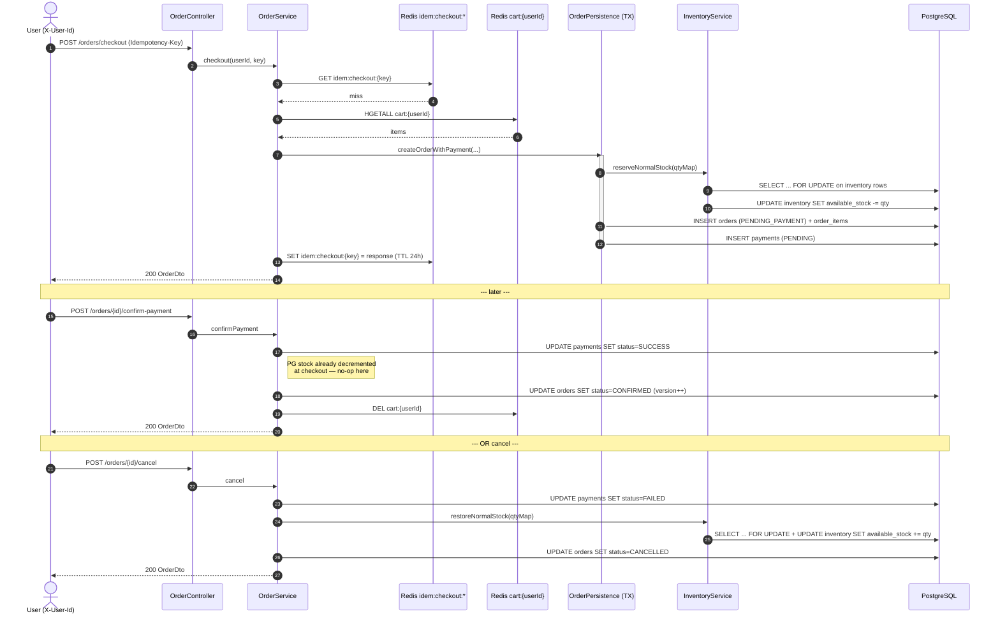
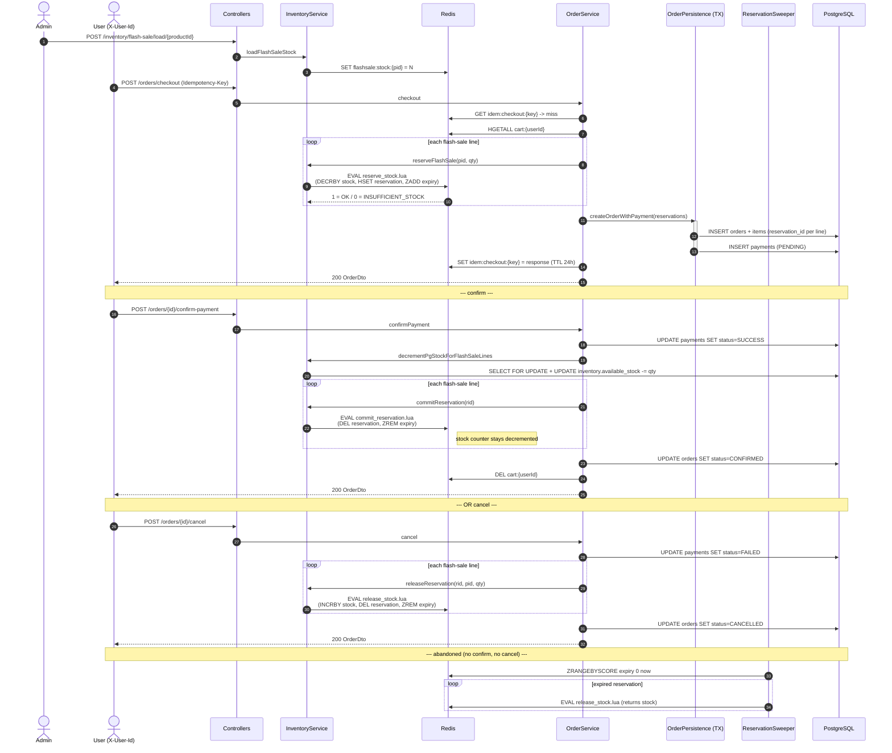

# Order flows

Two checkout paths share controllers, idempotency, and persistence — but use different reservation primitives.

- **Normal items** → PG row lock (`SELECT FOR UPDATE`) decrements `available_stock` at checkout.
- **Flash-sale items** → Redis Lua script atomically decrements `flashsale:stock:{pid}` at checkout; PG is only touched at confirm.

A single cart can mix both; each line picks its path based on whether `flashsale:stock:{pid}` exists in Redis.

## Normal-item flow (PG-locked reservation)

## Flash-sale flow (Redis-gated reservation)

## Key invariants

- **Normal flow** treats PG `available_stock` as the reservation primitive (decrement at checkout, restore on cancel, no-op on confirm).
- **Flash-sale flow** treats Redis as the reservation primitive (decrement at checkout) and PG as post-confirm truth (decrement at confirm, never reversed). The sweeper closes the abandonment hole that PG row locks naturally don't have.
- Idempotency cache wraps both flows identically — same `Idempotency-Key` twice returns the same `OrderDto`.
- `@Version` on `orders` plus `PENDING_PAYMENT`-only state guard prevents double-confirm / confirm+cancel races.
